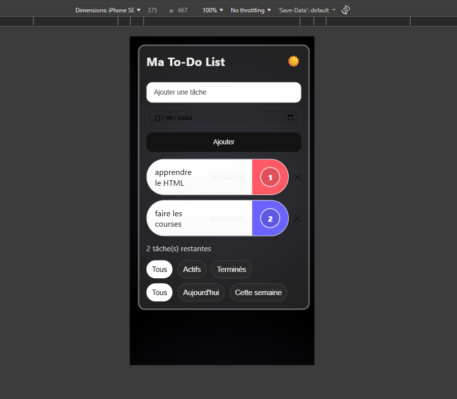
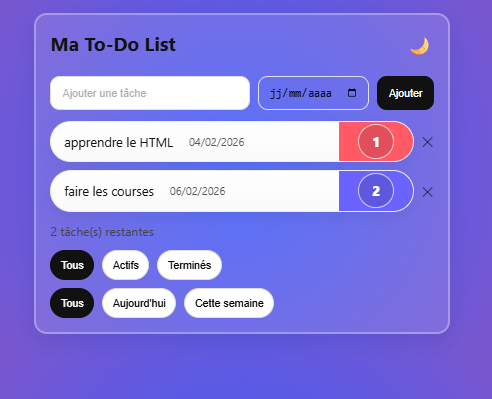

📝 To-Do List – Application Web

Une application To-Do List moderne et responsive, développée en HTML, CSS et JavaScript (Vanilla).
Elle permet de gérer ses tâches quotidiennes avec des vues temporelles, une persistance locale et un mode sombre.

## 🌍 Démo en ligne

👉 https://drakoven.github.io/todo-app/

## 📸 Aperçu

### 📱 Version mobile – Mode sombre

### 💻 Version desktop
